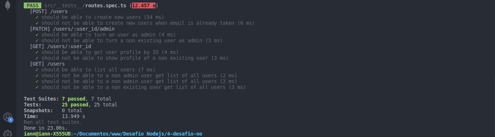
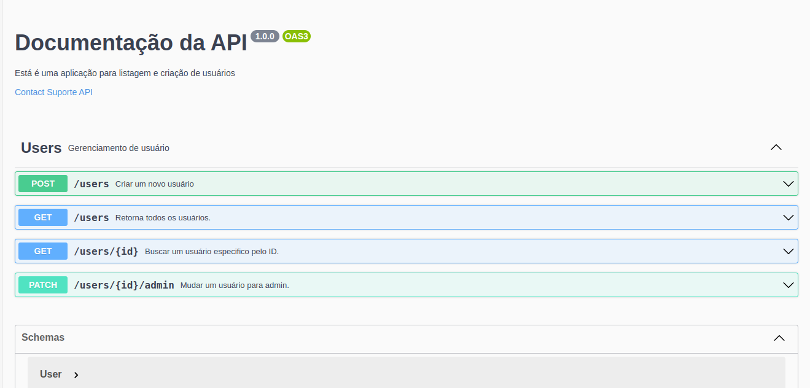
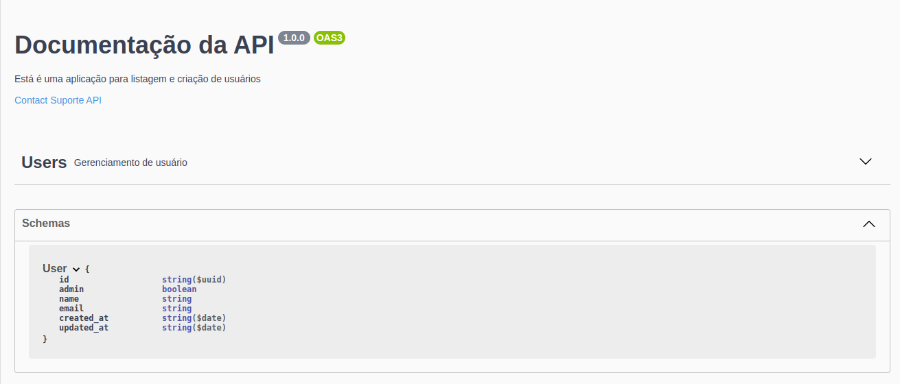

# 1ª Desafio - Introdução ao SOLID

  ## :computer: Sobre o desafio

  Nesse desafio, você deverá criar uma aplicação para treinar o que aprendeu até agora no Node.js!

  Essa será uma aplicação de listagem e cadastro de usuários. Para que a listagem de usuários funcione, o usuário que solicita a listagem deve ser um admin (mais detalhes ao longo da descrição).

  Implementar os códigos que estão faltando nos arquivos de **useCases**, **model** e **repositories**.

  - **Model**: Implementar as propriedades da entidade User, lembrando que a propriedade `admin` deve sempre ser iniciada como `false` e o `id` deve ser um `uuid` gerado automaticamente.

  - **Repositories**: Implementar as funcionalidade de: 
    - Criar usuário;
    - Procurar usuário pelo `id`;
    - Procurar usuário pelo `email`;
    - Listar todos os usuários;
    - Tornar um usuário como `admin`;

  - **UseCases**: Implementar as funcionalidades dos useCases e Controllers:
    - createUserController e createUserUseCase;
    - listAllUsersController e listAllUsersUseCase;
    - showUserProfileController e showUserProfileUseCase;
    - turnUserAdmin e turnUserUseCase;

  ## :camera: Screenshot

  

  <h3 align="center">Testes do model, repositório e de useCases</h3>
  

# 2º Desafio - Documentando API com Swagger

## :computer: Sobre o desafio

  Utilizando a aplicação desenvolvida no 1º desafio como base, realize a documentação das rotas com o Swagger.

## :man_technologist: Preparando ambiente para documentação

  - Instalar a lib `swagger-ui-express`;
  - Criar um arquivo JSON para escrever a documentação na especificação OpenAPI 3.0;
  - Instanciar na aplicação uma rota `api-docs` que vai servir a documentação;

## O que documentar?

  A documentação deve servir como uma descrição das entradas e saídas da sua API. Abaixo sugerimos os principais pontos que você deve documentar:

  - Informações gerais da API (nome, descrição, etc.);
  - Rotas;
  - Parâmetros;
  - Corpo da requisição;
  - Respostas de sucesso;
  - Respostas de erro;
  - Exemplos;

## :camera: Screenshots

  

    <h3>Documentação das Rotas</h3>
    
  

  

    <h3>Documentação do entidade User</h3>
    
  
